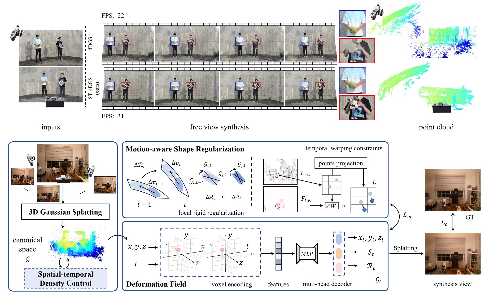

# ST-4DGS: Spatial-Temporally Consistent 4D Gaussian Splatting for Efficient Dynamic Scene Rendering
***
### SIGGRAPH 2024
***
Deqi Li<sup>1</sup>, Shi-Sheng Huang<sup>1</sup>, Zhiyuan Lu<sup>1</sup>, Xinran Duan<sup>1</sup>, Hua Huang<sup>1✉</sup>

<sup>1</sup>School of Artificial Intelligence, Beijing Normal University; <sup>✉</sup>Corresponding Author.
***




Our method guarantee the compactness of the 4D Gaussians that adhere to the surface in  
motion objects. It achieve  high-fidelity dynamic rendering quality and maintains real-time rendering efficiency.


<video width="720" height="540" controls>
    <source src="asset/cut_roasted_beef.mp4" type="video/mp4">
</video>

***

## Environmental Setups
Please follow the [3D-GS](https://github.com/graphdeco-inria/gaussian-splatting) to install the relative packages. And install some necessary environments in ```requirements.txt```.

```bash
git clone https://github.com/wanglids/ST-4DGS
cd ST-4DGS
conda create -n ST4DGS python=3.9
conda activate ST4DGS

pip install -r requirements.txt
pip install -e submodules/depth-diff-gaussian-rasterization
pip install -e submodules/simple-knn
```

## Data Preparation
We evaluate the proposed ST-4DGS on three publicly available datasets of dynamic scenes, namely [DyNeRF](https://github.com/facebookresearch/Neural_3D_Video), [ENeRF-Outdoor](https://github.com/zju3dv/ENeRF/blob/master/docs/enerf_outdoor.md)), and [Dynamic Scene](https://gorokee.github.io/jsyoon/dynamic_synth/). Download datasets form these links, you should extract the frames of each video and then organize your dataset as follows.
```
|── data
|	|── DyNeRF
|		|── cook_spinach
|			|── cam00
|			|── ...
|			|── cam08
|				|── images
|					|── 0.png
|					|── 1.png
|					|── 2.png
|					|── ...
|				|── flow
|					|── 0.npy
|					|── 1.npy
|					|── 2.npy
|					|── ...

|			|── ...
|			|── cam19
|			|── colmap
|				|── input
|					|── cam00.png
|					|── ...
|					|── cam19.png
|		|── ...
|	|── ENeRF-Outdoor
|		|── ...
|	|── Dynamic Scene
|		|── ...
```
The ```colmap/input``` folder is the collection data of different cameras at the same time. Calculate camera parameters and initialize Gaussians based on [COLMAP](https://github.com/colmap/colmap) (execute ```python scripts/convert.py```). The optical flow is estimated by [RAFT](https://github.com/princeton-vl/RAFT). You can place **scripts/getFlow.py** in the installation root directory of [RAFT](https://github.com/princeton-vl/RAFT) (such as ./submodels/RAFT) and then estimate the optical flow via running
```
cd $ ROOT_PATH/submodels/RAFT
python getFlow.py --source_path rootpath/data/DyNeRF/cook_spinach --win_size timestep
```


## Training 
For cook_spinach dataset, run
```
cd $ ROOT_PATH/
python train.py --source_path rootpath/data/DyNeRF/cook_spinach --model_path output/test --configs arguments/DyNeRF.py    
#The results will be saved in rootpath/data/cook_spinach/output/test
```


## Rendering
You can download [pre trained data and models](https://drive.google.com/drive/folders/1sS5XDBkcAz4A4Lovl7-h-gsWF51nwy9F?usp=sharing) and place them in the **output/test** folder. Run the following script to render the images.
```
cd $ ROOT_PATH/
python render.py --source_path rootpath/data/DyNeRF/cook_spinach --model_path output/test --configs arguments/DyNeRF.py
```

In addition, you can also use Viewer as [3DGS](https://github.com/graphdeco-inria/gaussian-splatting) or [4DGS](https://github.com/hustvl/4DGaussians) to view rendering images.

---

## Citation
If you find this code useful for your research, welcome to cite the following paper:
```
@inproceedings{Li2024ST,
  title={ST-4DGS: Spatial-Temporally Consistent 4D Gaussian Splatting for Efficient Dynamic Scene Rendering},
  author={Li, Deqi and Huang, Shi-Sheng and Lu, Zhiyuan and Duan, Xinran and Hua, Huang},
  booktitle={ACM SIGGRAPH 2024 Conference Proceedings},
  pages={1--10},
  year={2024}
}
```
## Acknowledgments
Our training code is build upon [3DGS](https://github.com/graphdeco-inria/gaussian-splatting), [4DGS](https://github.com/hustvl/4DGaussians), [D3DGS](https://dynamic3dgaussians.github.io/). We sincerely appreciate these excellent works.

